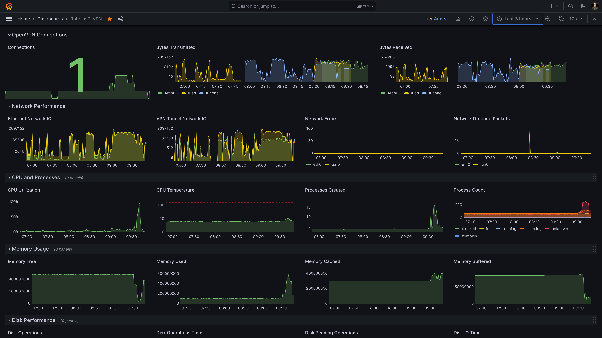

# Monitoring a Raspberry PI OpenVPN Server

[](LICENSE)

## Table of Contents

- [Description](#description)
- [Installation](#installation)
- [Usage](#usage)
- [Contributing](#contributing)
- [License](#license)

## Description

This project introduces a custom OpenTelemetry Collector distribution intended to monitor an OpenVPN server on a Raspberry PI. It's developed to provide detailed insights into both the OpenVPN server performance and the Raspberry PI's system health.

Key features of this custom distribution include:

1. **Multiple Receivers**: 
    - **Host Metrics Receiver**: Provides a wide range of system metrics, compatible with Linux, Windows, and MacOS.
    - **OpenVPN Receiver**: A specialized receiver that collects data on OpenVPN connections and transmission metrics.
    - **PI Receiver**: Focuses on Raspberry PI-specific metrics, starting with CPU temperature monitoring.

2. **Data Processing**:
    - **Batch Processor**: Optimizes data processing for efficiency and performance.

3. **Data Exporting**:
    - **OTLP HTTP Exporter**: Facilitates data export, allowing for integration with various backends, including Grafana Cloud.

4. **Security Extension**:
    - **Basic Auth Extension**: Ensures secure connectivity, particularly for cloud-based data analysis platforms.

5. **Versatile Monitoring Capabilities**:
    - Tracks a comprehensive range of metrics like OpenVPN connection counts, traffic rates by user, network I/O rates, CPU utilization and temperature, system memory and disk usage, and more.

6. **Developer Tools**:
    - Includes a VS Code DevContainer with necessary dependencies, a JSON file for dashboard import (with an example dashboard for Grafana), and a configuration file for the custom OTEL distribution.

The custom distribution will allow users to monitor the performance of OpenVPN servers and Raspberry PI systems. While it integrates well with Grafana for visualizations, its flexible design allows for compatibility with various other backends using OTLP or by adding additional extensions.

### Detailed Visualizations

The example dashboard provided with this custom OpenTelemetry Collector distribution features 19 curated visualizations. These visualizations are organized to prioritize crucial information at the top, facilitating a comprehensive understanding of how different conditions might impact the performance of your OpenVPN server. 


*This Grafana dashboard captures a specific period of network and system activity. Around 8:00-9:00 AM, a single stream was watched remotely, pausing a few times. The brief spike in dropped network packets just before 8:30 AM corresponds to a temporary connection loss from the iPhone, not the Raspberry Pi. At 9:00 AM, the network load increased due to three simultaneous streams initiated from different devices. Finally, at 9:30 AM, a connection to a remote DevContainer on the device and the initiation of a build process are visible, marked by a noticeable increase in CPU, memory, and disk usage, showcasing the system's responsiveness to varying computational demands.*


1. **OpenVPN Connections**: This category provides a comprehensive view of the VPN's operational status, showcasing active connections and traffic rates. These visuals are useful for assessing the usage and performance of the VPN server, enabling administrators to monitor user activity and manage network bandwidth effectively.

2. **Network Performance**: This section focuses on the health and efficiency of network interfaces, including VPN tunnels and Ethernet connections. It helps in identifying network bottlenecks, errors, and packet loss, which are vital for maintaining optimal connectivity and ensuring reliable data transmission across the network.

3. **CPU and Processes**: This category offers insights into the server's processing power and workload distribution. By monitoring CPU utilization, temperature, and process activities, users can detect potential overloads or inefficiencies, ensuring the server operates within safe parameters and maintains optimal performance.

4. **Memory Usage**: These visuals provide an in-depth look at how the system's memory is being utilized, including free, used, cached, and buffered memory. Understanding memory distribution is key for optimizing system performance, preventing slowdowns, and planning for scalable resource allocation.

5. **Disk Performance**: This section delivers crucial data on disk activity, including read/write operations, operation time, and I/O metrics. These insights are essential for assessing the health and performance of storage systems, identifying potential disk-related bottlenecks, and ensuring efficient data processing and retrieval.

A well-crafted dashboard narrates a coherent story, guiding the user through a logical progression of metrics for a thorough understanding of the system's state. 

1. Beginning with the 'OpenVPN Connections', users can immediately grasp the number of active connections and which ones are consuming the most bandwidth. 
2. This sets the stage for digging into 'Network Performance', where the impact of these connections on network health — such as errors and packet drops — becomes apparent. 
3. From here, the 'CPU and Processes' category offers insights into how these network activities influence the server’s processing load. 
4. This leads logically into 'Memory Usage', highlighting the effects on system memory, crucial for overall performance. 
5. Finally, 'Disk Performance' rounds off the story, revealing the downstream impact on storage systems, completing the picture of how network activities and system resources interact and influence each other.

### Metric Sources

The metrics that drive the visualizations derive from the three receivers configured for the collector:

1. **Host Metrics Receiver** -  
   * system_network_io 
   * system_network_errors
   * system_network_dropped
   * system_cpu_time
   * system_processes_created
   * system_processes_count
   * system_memory_usage
   * system_disk_operations
   * system_disk_operation_time
   * system_disk_pending_operations
   * system_disk_io_time
2. **OpenVPNReciever** - 
   * open_vpnconnections
   * openvpn_bytes (by direction)
3. **PI Receiver** -
   * raspberry_pi_thermal_zone_temperature

## Installation

The easiest way to get started is to use the [DevContainer](./.devcontainer). To do this with VS Code, first
clone the repository locally and then open the root folder of ther repository. Make sure 
the [Dev Containers](https://marketplace.visualstudio.com/items?itemName=ms-vscode-remote.remote-containers) extension is added to VS Code. You will be prompted to *Reopen in Container*. Once the container is created and running use Ctrl+Shift-` to open a terminal.

There is a [Dockerfile](./Dockerfile) in the root of the project that may be used
to build and export the executable. Although you can modify this
to also build an image for running as a Docker container, mapping to
host resources for scraping metrics is required and beyond the scope of this readme.

If you want to install the preqrequisites locally you will need:

* Dev tools including Make
* [Go 1.21](https://go.dev) or later
* The following Go modules:
    * go.opentelemetry.io/collector/cmd/builder@latest
    * github.com/open-telemetry/opentelemetry-collector-contrib/cmd/mdatagen@latest
* For developing in VS Code with the [Go extension](https://marketplace.visualstudio.com/items?itemName=golang.go):
    * golang.org/x/tools/gopls@latest
    * github.com/go-delve/delve/cmd/dlv@latest

## Usage

Make a copy of `otelcol.example.yaml` to `otelcol.yaml` and update
the settings.

1. The `otlphttp` exporter `endpoint` needs to be set to the backend OTLP endpoint. 
2. The `basicauth/otlp` `username` and `password` need defined. 

If you are using Grafana Cloud, there are instructions [here](https://grafana.com/docs/grafana-cloud/send-data/otlp/send-data-otlp/) for how to set these
options.

The `Makefile` has the following targets:

* `all` - Default target (calls `build`)
* `build` - Build the collector, using current architecture, output to ./build/otelcol-dev
* `release` - Build the collector, using target architecture, output to ./build/otelcol-linux-arm
* `docker` - Build the collector using Docker and target architecture, output to ./build/otelcol-linux-arm
* `clean` - Clean the build artifacts (delete `./build` directory)
* `test` - Run tests for `openvpnreciver` and `pireceiver`
* `setup` - Install dependencies (`builder`, `mdatagen`)

The target architecture for `release` and `docker` can be overridden
with TARGETOS and TARGETARCH. For example:

```bash
make release TARGETOS=windows TARGETARCH=amd64
```

Once you have a binary, you can run it using the following command:

```bash
./build/otelcol-linux-arm --config otelcol.yaml
```

## Contributing Guidelines

To contribute to this project:

1. **Communicate via Issues**: Use GitHub Issues for discussion.
2. **Fork and Branch**: Fork the repository and create a new branch for your work.
3. **Pull Requests Welcome**: Submit pull requests for your contributions.
4. **Stay Consistent**: Follow the existing code style and conventions.
5. **Be Respectful**: Engage respectfully with the community.

Thank you for your contributions!

## License

This project is licensed under the [MIT License](LICENSE).
